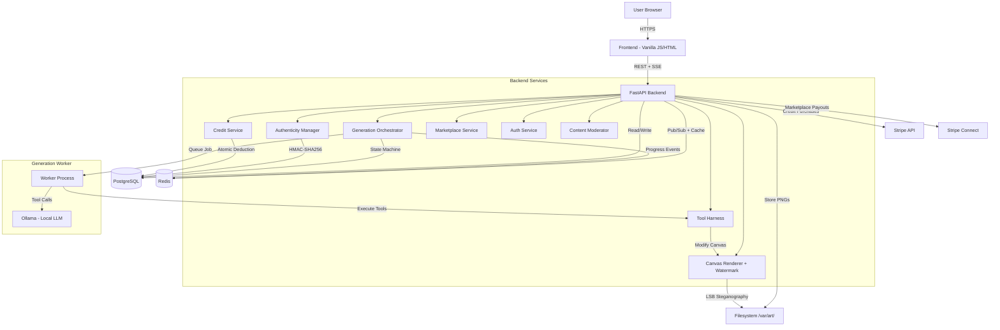

# Pixel Art Collectible Platform — Architecture Plan

> **For Claude:** REQUIRED SUB-SKILL: Use superpowers:executing-plans to implement this plan task-by-task.

**Goal:** Build an MVP web platform where a platform-hosted open-source LLM (via Ollama) generates unique abstract pixel art as digital collectibles, purchasable with credit packs and tradeable on a built-in marketplace.

**Architecture:** FastAPI monolith with async generation workers, PostgreSQL, Redis (pub/sub + caching), in-memory Pillow canvas with tool-calling harness, steganographic watermarking, Stripe + Stripe Connect for payments and marketplace payouts.

**Tech Stack:** Python 3.12, FastAPI, PostgreSQL, Redis, Pillow, Ollama, Stripe, Pydantic v2

**Future:** BYOM (Bring Your Own Model) as an advanced tier feature — users connect their own Ollama endpoint via a local agent. The tool harness is model-agnostic; BYOM adds an agent gateway layer on top of the existing architecture.

---

## Executive Summary

The platform hosts an open-source LLM (e.g., Llama 3.1, Qwen 2.5) via Ollama on its own infrastructure. When a user clicks "Generate," a backend worker sends the prompt and tool definitions to the local Ollama instance, which iteratively calls drawing tools (set_pixel, fill_rect, draw_line, etc.) to compose artwork on a server-side Pillow canvas. Style, subject, palette, and composition are entirely the model's creative decision.

Users purchase credit packs ($5 = 10 credits, $10 = 25 credits, $20 = 60 credits) to generate art at three tiers: Small (16x16, 1 credit), Medium (32x32, 3 credits), Large (64x64, 5 credits). Each tier unlocks progressively more drawing tools.

The platform renders the final canvas to PNG, embeds a steganographic watermark (LSB encoding of art_id + owner_id), and stores the piece with a cryptographic Seal of Authenticity (HMAC-SHA256). Users can list paid art on a marketplace; trades execute via Stripe Connect with a 10% platform fee. Ownership transfers are recorded in an append-only provenance ledger.

Free tier: 1 small generation per day (requires phone verification), non-tradeable. Credit-purchased art is tradeable on the marketplace. Value is driven by canvas size and complexity, not artificial rarity — every piece is inherently unique due to non-deterministic LLM generation.

Since the platform controls the model, provenance is fully verified — the platform knows exactly which model, version, and tool calls produced each piece.

---

## System Design



### Component Breakdown

| Component | Responsibility | Pattern |
|---|---|---|
| **Generation Orchestrator** | State machine (PENDING → EXECUTING_TOOLS → SEALING → COMPLETE/FAILED), saga compensation, job queue management | State Machine + Saga |
| **Generation Worker** | Picks job from queue, calls Ollama, executes tool-calling loop, manages in-memory canvas lifecycle | Worker + Loop |
| **Tool Harness** | Validate + execute tool calls on server-side canvas. Enum-constrained names, Pydantic strict-mode args, tier-gated tool access | Command Pattern + Static Dispatch |
| **Credit Service** | Credit pack purchases, atomic deduction, reconciliation via snapshots, refunds | Double-Entry Ledger |
| **Canvas Renderer** | In-memory PIL.Image during generation, periodic checkpointing (every 50 tool calls), final PNG + thumbnail, LSB watermark embedding | In-Memory + Checkpoint |
| **Authenticity Manager** | HMAC-SHA256 seal creation/verification, key versioning | HMAC with Key Rotation |
| **Marketplace Service** | Listings CRUD, trade execution with pessimistic locking, Stripe Connect payouts | Repository + FOR UPDATE |
| **Auth Service** | JWT (15min access + 7-day refresh), bcrypt, step-up MFA for high-value actions | JWT + TOTP |
| **Content Moderator** | Post-generation scan for offensive content, flagging queue | Pipeline Filter |

### Data Flow: Art Generation

```
 1. User clicks "Generate" → POST /api/v1/generations (tier selection)
 2. Credit Service: atomic deduction (UPDATE WHERE balance >= cost) + ledger entry
    — Both in same DB transaction with job creation
 3. Generation Orchestrator: create job (PENDING), SSE event → browser
 4. Worker picks job from queue → status EXECUTING_TOOLS
 5. Worker sends system prompt + tool definitions to local Ollama
 6. Ollama returns tool call(s)
 7. Tool Harness validates (Pydantic strict, enum tool name, tier-gated)
 8. Canvas Renderer executes tool on in-memory PIL.Image
 9. Worker sends tool result back to Ollama → loop (steps 6-9)
10. Model calls seal_canvas() OR hard budget reached → loop ends
11. Canvas Renderer: final PNG + LSB watermark + thumbnail
12. Authenticity Manager: HMAC seal (art_id + creator_id + timestamp + image_hash)
13. Store: PNG to filesystem, metadata + seal to PostgreSQL
14. Generation Orchestrator: job → COMPLETE, SSE event → browser
15. User sees completed art in their collection
```

### Data Flow: Marketplace Trade

```
1. Seller: POST /api/v1/marketplace/listings (art_id, asking_price)
   → BEGIN TRANSACTION
   → SELECT art_pieces FOR UPDATE (lock row — prevents concurrent trade/listing)
   → Verify ownership + is_tradeable + not already listed
   → INSERT marketplace_listings
   → UPDATE art_pieces SET is_marketplace_listed = TRUE
   → COMMIT
   (Partial unique index prevents duplicate active listings as DB-level backstop)

2. Buyer: POST /api/v1/marketplace/purchase (listing_id)
   → BEGIN TRANSACTION
   → SELECT listing FOR UPDATE (lock row)
   → Stripe Connect charge (buyer pays, platform takes 10%, seller gets 90%)
   → INSERT ownership_history (seller → buyer)
   → UPDATE art_pieces.current_owner_id = buyer
   → Re-encode LSB watermark with new owner_id
   → UPDATE listing status = 'sold'
   → COMMIT

3. Both users see updated ownership + provenance chain
```

### Data Flow: Credit Purchase

```
1. User: POST /api/v1/credits/purchase (pack_id)
2. Credit Service creates Stripe Checkout session for selected pack
3. Stripe webhook confirms payment
4. Credit Service: INSERT credit_transactions (credit, pack purchase) + UPDATE users.credit_balance
5. Payment record stored with Stripe payment intent ID
6. User sees updated credit balance
```

### State Machine

```
PENDING ──(worker picks up)──→ EXECUTING_TOOLS
                                    │
                                    ├──(seal_canvas / budget hit)──→ SEALING ──→ COMPLETE
                                    ├──(worker crash / timeout)──→ FAILED (full refund)
                                    ├──(all tool calls invalid)──→ FAILED (full refund)
                                    └──(user cancel)──→ FAILED (partial refund, 50% min)

PENDING ──(5min no worker picks up)──→ FAILED (full refund, platform fault)
```

### Saga Compensation Policies

| Failure Scenario | Detection | Compensation |
|---|---|---|
| No worker available | PENDING > 5 min (platform overloaded) | Full credit refund |
| Worker crash mid-generation | Worker process dies, job stuck in EXECUTING_TOOLS | Full refund (platform fault) |
| Ollama timeout / error | Ollama unresponsive or returns error | Full refund (platform fault) |
| Model outputs garbage | All tool calls fail validation (nonsensical output) | Full refund |
| User cancels mid-generation | User calls DELETE /api/v1/generations/{id} | Partial refund: `credits * (1 - tool_calls_done / soft_budget)`, minimum 50% |
| Content moderation flags result | Post-generation scan detects offensive content | Full refund (piece not delivered) |

---

## Data Models

### PostgreSQL Schema

```sql
-- ============================================================
-- USERS & AUTH
-- ============================================================

CREATE TABLE users (
    user_id             UUID PRIMARY KEY DEFAULT gen_random_uuid(),
    email               VARCHAR(255) UNIQUE NOT NULL,
    username            VARCHAR(50) UNIQUE NOT NULL,
    password_hash       VARCHAR(255) NOT NULL,
    phone_hash          VARCHAR(64) UNIQUE,        -- SHA-256 of verified phone (for free tier)
    phone_verified      BOOLEAN NOT NULL DEFAULT FALSE,
    stripe_customer_id  VARCHAR(100) UNIQUE,
    stripe_connect_id   VARCHAR(100) UNIQUE,
    token_version       INTEGER NOT NULL DEFAULT 0,
    mfa_secret_enc      BYTEA,
    mfa_enabled         BOOLEAN NOT NULL DEFAULT FALSE,
    credit_balance      INTEGER NOT NULL DEFAULT 0, -- denormalized, reconciled nightly
    free_generations_today INTEGER NOT NULL DEFAULT 0,
    last_free_gen_date  DATE,
    created_at          TIMESTAMPTZ NOT NULL DEFAULT NOW(),
    is_active           BOOLEAN NOT NULL DEFAULT TRUE
);

-- ============================================================
-- CREDIT SYSTEM
-- ============================================================

CREATE TABLE credit_pack_definitions (
    pack_id             SERIAL PRIMARY KEY,
    name                VARCHAR(50) NOT NULL,       -- e.g. "Starter Pack"
    price_cents         INTEGER NOT NULL,            -- 500, 1000, 2000
    credit_amount       INTEGER NOT NULL,            -- 10, 25, 60
    is_active           BOOLEAN NOT NULL DEFAULT TRUE
);

INSERT INTO credit_pack_definitions (name, price_cents, credit_amount) VALUES
    ('Starter Pack', 500, 10),
    ('Value Pack', 1000, 25),
    ('Pro Pack', 2000, 60);

CREATE TABLE credit_transactions (
    txn_id              BIGSERIAL,
    user_id             UUID NOT NULL REFERENCES users(user_id),
    amount              INTEGER NOT NULL,            -- positive = credit, negative = debit
    txn_type            VARCHAR(30) NOT NULL
                        CHECK (txn_type IN (
                            'pack_purchase', 'generation_debit', 'refund',
                            'goodwill_credit', 'marketplace_earning'
                        )),
    reference_id        UUID,                        -- job_id, payment_id, etc.
    created_at          TIMESTAMPTZ NOT NULL DEFAULT NOW(),
    PRIMARY KEY (txn_id, created_at)
) PARTITION BY RANGE (created_at);

-- Monthly partitions (auto-created by pg_partman or cron)
-- Partitions older than 24 months: DETACH + archive to cold storage

CREATE TABLE credit_balance_snapshots (
    snapshot_id         BIGSERIAL PRIMARY KEY,
    user_id             UUID NOT NULL REFERENCES users(user_id),
    balance             INTEGER NOT NULL,
    as_of_txn_id        BIGINT NOT NULL,
    snapshot_at         TIMESTAMPTZ NOT NULL DEFAULT NOW(),
    UNIQUE (user_id, as_of_txn_id)
);

-- ============================================================
-- GENERATION TIERS
-- ============================================================

CREATE TABLE generation_tier_definitions (
    tier_id             SERIAL PRIMARY KEY,
    tier_name           VARCHAR(20) NOT NULL UNIQUE, -- 'small', 'medium', 'large'
    canvas_width        INTEGER NOT NULL,
    canvas_height       INTEGER NOT NULL,
    credit_cost         INTEGER NOT NULL,
    tool_budget_soft    INTEGER NOT NULL,             -- model should aim to finish by here
    tool_budget_hard    INTEGER NOT NULL,             -- forced termination
    job_timeout_seconds INTEGER NOT NULL,
    allowed_tools       JSONB NOT NULL                -- ["set_pixel", "fill_rect", ...]
);

INSERT INTO generation_tier_definitions
    (tier_name, canvas_width, canvas_height, credit_cost, tool_budget_soft, tool_budget_hard, job_timeout_seconds, allowed_tools)
VALUES
    ('small',  16, 16, 1, 100,  500,   300,  '["set_pixel","fill_rect","set_palette","seal_canvas"]'),
    ('medium', 32, 32, 3, 500,  2000,  900,  '["set_pixel","fill_rect","set_palette","seal_canvas","draw_line","draw_circle","flood_fill"]'),
    ('large',  64, 64, 5, 1000, 10000, 1800, '["set_pixel","fill_rect","set_palette","seal_canvas","draw_line","draw_circle","flood_fill","gradient_fill","dither","mirror","rotate"]');

-- ============================================================
-- ART PIECES & PROVENANCE
-- ============================================================

CREATE TABLE art_pieces (
    art_id              UUID PRIMARY KEY DEFAULT gen_random_uuid(),
    creator_user_id     UUID NOT NULL REFERENCES users(user_id) ON DELETE RESTRICT,
    current_owner_id    UUID NOT NULL REFERENCES users(user_id) ON DELETE RESTRICT,
    generation_tier     VARCHAR(20) NOT NULL,
    canvas_width        INTEGER NOT NULL CHECK (canvas_width > 0),
    canvas_height       INTEGER NOT NULL CHECK (canvas_height > 0),
    model_name          VARCHAR(255) NOT NULL,        -- platform-verified (e.g. "llama3.1:8b")
    model_version       VARCHAR(50),                  -- platform-verified
    rendered_image_path VARCHAR(500) NOT NULL,
    thumbnail_path      VARCHAR(500),
    generation_hash     VARCHAR(64) NOT NULL UNIQUE,  -- SHA-256 of final PNG
    seal_signature      VARCHAR(255) NOT NULL,
    seal_key_version    INTEGER NOT NULL DEFAULT 1,
    is_tradeable        BOOLEAN NOT NULL DEFAULT FALSE,
    is_marketplace_listed BOOLEAN NOT NULL DEFAULT FALSE,
    times_traded        INTEGER NOT NULL DEFAULT 0,
    created_at          TIMESTAMPTZ NOT NULL DEFAULT NOW()
);

CREATE TABLE ownership_history (
    record_id           BIGSERIAL PRIMARY KEY,
    art_id              UUID NOT NULL REFERENCES art_pieces(art_id) ON DELETE RESTRICT,
    from_user_id        UUID REFERENCES users(user_id) ON DELETE RESTRICT,
    to_user_id          UUID NOT NULL REFERENCES users(user_id) ON DELETE RESTRICT,
    transfer_type       VARCHAR(20) NOT NULL CHECK (transfer_type IN ('creation', 'purchase')),
    transaction_id      UUID,
    transferred_at      TIMESTAMPTZ NOT NULL DEFAULT NOW()
);

-- ============================================================
-- GENERATION JOBS
-- ============================================================

CREATE TABLE art_generation_jobs (
    job_id              UUID PRIMARY KEY DEFAULT gen_random_uuid(),
    user_id             UUID NOT NULL REFERENCES users(user_id),
    generation_tier     VARCHAR(20) NOT NULL,
    idempotency_key     VARCHAR(255) UNIQUE,
    status              VARCHAR(20) NOT NULL DEFAULT 'pending'
                        CHECK (status IN (
                            'pending', 'executing_tools', 'sealing',
                            'complete', 'failed', 'cancelled'
                        )),
    art_id              UUID REFERENCES art_pieces(art_id),
    tool_calls_executed INTEGER NOT NULL DEFAULT 0,
    checkpoint_canvas   BYTEA,                        -- transient, NULLed after completion
    checkpoint_tool_idx INTEGER DEFAULT 0,
    last_checkpoint_at  TIMESTAMPTZ,
    last_progress_at    TIMESTAMPTZ,                  -- updated on each tool call execution
    error_message       TEXT,
    compensation_type   VARCHAR(30),
    compensation_amount INTEGER,
    created_at          TIMESTAMPTZ NOT NULL DEFAULT NOW(),
    completed_at        TIMESTAMPTZ
);

-- ============================================================
-- GENERATION ANALYTICS & ARCHIVES
-- ============================================================

CREATE TABLE generation_summaries (
    summary_id          BIGSERIAL PRIMARY KEY,
    job_id              UUID NOT NULL REFERENCES art_generation_jobs(job_id),
    art_id              UUID REFERENCES art_pieces(art_id),
    total_tool_calls    INTEGER NOT NULL,
    tool_call_breakdown JSONB NOT NULL,               -- {"set_pixel": 312, "draw_line": 45}
    first_tool_call_at  TIMESTAMPTZ NOT NULL,
    last_tool_call_at   TIMESTAMPTZ NOT NULL,
    generation_duration_ms INTEGER NOT NULL,
    created_at          TIMESTAMPTZ NOT NULL DEFAULT NOW()
);

CREATE TABLE tool_call_archives (
    archive_id          BIGSERIAL PRIMARY KEY,
    job_id              UUID NOT NULL REFERENCES art_generation_jobs(job_id),
    tool_calls_gz       BYTEA NOT NULL,               -- gzip-compressed JSON array
    toolcall_sequence_hash VARCHAR(64),               -- SHA-256 of full sequence (replay detection)
    created_at          TIMESTAMPTZ NOT NULL DEFAULT NOW()
);
-- Retention: 90 days (success), 30 days (failed), 1 year (flagged)

-- ============================================================
-- MARKETPLACE
-- ============================================================

CREATE TABLE marketplace_listings (
    listing_id          UUID PRIMARY KEY DEFAULT gen_random_uuid(),
    art_id              UUID NOT NULL REFERENCES art_pieces(art_id) ON DELETE RESTRICT,
    seller_user_id      UUID NOT NULL REFERENCES users(user_id) ON DELETE RESTRICT,
    asking_price_cents  INTEGER NOT NULL CHECK (asking_price_cents > 0),
    currency_code       VARCHAR(3) NOT NULL DEFAULT 'USD',
    status              VARCHAR(20) NOT NULL DEFAULT 'active'
                        CHECK (status IN ('active', 'sold', 'cancelled')),
    listed_at           TIMESTAMPTZ NOT NULL DEFAULT NOW(),
    sold_at             TIMESTAMPTZ,
    cancelled_at        TIMESTAMPTZ
);

CREATE TABLE transactions (
    transaction_id      UUID PRIMARY KEY DEFAULT gen_random_uuid(),
    buyer_user_id       UUID NOT NULL REFERENCES users(user_id) ON DELETE RESTRICT,
    seller_user_id      UUID NOT NULL REFERENCES users(user_id) ON DELETE RESTRICT,
    art_id              UUID NOT NULL REFERENCES art_pieces(art_id) ON DELETE RESTRICT,
    listing_id          UUID NOT NULL REFERENCES marketplace_listings(listing_id) ON DELETE RESTRICT,
    amount_cents        INTEGER NOT NULL CHECK (amount_cents > 0),
    platform_fee_cents  INTEGER NOT NULL DEFAULT 0,
    seller_payout_cents INTEGER NOT NULL,
    stripe_payment_intent_id VARCHAR(100) UNIQUE,
    status              VARCHAR(20) NOT NULL DEFAULT 'pending'
                        CHECK (status IN ('pending', 'completed', 'failed', 'refunded')),
    failure_reason      TEXT,
    initiated_at        TIMESTAMPTZ NOT NULL DEFAULT NOW(),
    completed_at        TIMESTAMPTZ,
    CONSTRAINT amount_breakdown CHECK (amount_cents = platform_fee_cents + seller_payout_cents),
    CONSTRAINT no_self_trade CHECK (buyer_user_id != seller_user_id)
);

-- ============================================================
-- PAYMENTS & WEBHOOKS
-- ============================================================

CREATE TABLE payment_records (
    payment_id          UUID PRIMARY KEY DEFAULT gen_random_uuid(),
    user_id             UUID NOT NULL REFERENCES users(user_id) ON DELETE RESTRICT,
    payment_type        VARCHAR(30) NOT NULL
                        CHECK (payment_type IN (
                            'credit_pack_purchase', 'marketplace_purchase'
                        )),
    amount_cents        INTEGER NOT NULL CHECK (amount_cents >= 0),
    stripe_payment_intent_id VARCHAR(100) UNIQUE,
    status              VARCHAR(20) NOT NULL DEFAULT 'pending'
                        CHECK (status IN ('pending', 'succeeded', 'failed', 'refunded')),
    created_at          TIMESTAMPTZ NOT NULL DEFAULT NOW()
);

CREATE TABLE processed_webhooks (
    event_id            VARCHAR(255) PRIMARY KEY,
    processed_at        TIMESTAMPTZ NOT NULL DEFAULT NOW()
);

-- ============================================================
-- SECURITY & KEYS
-- ============================================================

CREATE TABLE hmac_keys (
    version             INTEGER PRIMARY KEY,
    key_material        BYTEA NOT NULL,
    created_at          TIMESTAMPTZ NOT NULL DEFAULT NOW(),
    retired_at          TIMESTAMPTZ
);

-- ============================================================
-- TOOL PROMPT TEMPLATES
-- ============================================================

CREATE TABLE tool_prompt_templates (
    template_id         UUID PRIMARY KEY DEFAULT gen_random_uuid(),
    tier                VARCHAR(20) NOT NULL,
    system_prompt       TEXT NOT NULL,                -- system prompt describing available tools
    tool_definitions    JSONB NOT NULL,               -- JSON tool schemas sent to Ollama
    version             INTEGER NOT NULL,
    is_active           BOOLEAN NOT NULL DEFAULT TRUE,
    created_at          TIMESTAMPTZ NOT NULL DEFAULT NOW()
);
```

### Key Indexes

```sql
-- Users
CREATE INDEX idx_users_phone ON users(phone_hash) WHERE phone_hash IS NOT NULL;

-- Art
CREATE INDEX idx_art_owner ON art_pieces(current_owner_id);
CREATE INDEX idx_art_creator ON art_pieces(creator_user_id);
CREATE INDEX idx_art_listed ON art_pieces(is_marketplace_listed) WHERE is_marketplace_listed = TRUE;

-- Provenance
CREATE INDEX idx_ownership_art ON ownership_history(art_id, transferred_at DESC);

-- Marketplace
CREATE INDEX idx_listings_active ON marketplace_listings(status, listed_at DESC) WHERE status = 'active';
CREATE INDEX idx_listings_seller ON marketplace_listings(seller_user_id, status);
CREATE UNIQUE INDEX idx_one_active_listing_per_art ON marketplace_listings(art_id) WHERE status = 'active';

-- Transactions
CREATE INDEX idx_txn_buyer ON transactions(buyer_user_id, completed_at DESC);
CREATE INDEX idx_txn_seller ON transactions(seller_user_id, completed_at DESC);

-- Jobs
CREATE INDEX idx_jobs_user ON art_generation_jobs(user_id, created_at DESC);
CREATE INDEX idx_jobs_pending ON art_generation_jobs(status) WHERE status IN ('pending', 'executing_tools');

-- Credits
CREATE INDEX idx_credit_txn_user ON credit_transactions(user_id, txn_id);
CREATE INDEX idx_snapshot_user_latest ON credit_balance_snapshots(user_id, as_of_txn_id DESC);

-- Archives
CREATE INDEX idx_archive_cleanup ON tool_call_archives(created_at, job_id);
```

### Protective Triggers

```sql
-- Prevent modification of ownership_history (append-only)
CREATE TRIGGER prevent_ownership_modify
BEFORE UPDATE OR DELETE ON ownership_history
FOR EACH ROW EXECUTE FUNCTION raise_immutable_error();

-- Enforce art_pieces immutability on core fields
CREATE TRIGGER enforce_art_immutability
BEFORE UPDATE ON art_pieces
FOR EACH ROW EXECUTE FUNCTION check_immutable_art_fields();

-- Sync current_owner_id when ownership_history is inserted
CREATE TRIGGER sync_owner
AFTER INSERT ON ownership_history
FOR EACH ROW EXECUTE FUNCTION update_current_owner();

-- Sync is_marketplace_listed flag
CREATE TRIGGER sync_listing_flag
AFTER INSERT OR UPDATE ON marketplace_listings
FOR EACH ROW EXECUTE FUNCTION update_listing_flag();
```

---

## Security Protocols

### Threat Priority Matrix

| Priority | Threat | Mitigation |
|---|---|---|
| **P0** | Host machine compromise | Full Docker containerization — no host mounts, no host networking, read-only app filesystem, non-root user |
| **P0** | Tool parameter injection (internal defense-in-depth) | Pydantic strict mode, enum-constrained tool names, static dispatch, tier-gated tools |
| **P1** | Credit race conditions | Atomic `UPDATE WHERE balance >= cost RETURNING balance` |
| **P1** | Marketplace double-sale | SELECT FOR UPDATE on listing + art piece rows |
| **P1** | Payment fraud → art laundering | 24h hold on new credits, chargeback monitoring, trade velocity limits for accounts < 30 days |
| **P2** | Free tier Sybil | Phone verification for free tier access, non-tradeable art (economic containment) |
| **P2** | Ollama prompt injection | System prompt hardened, tool-only output mode, no user-supplied prompts |
| **P2** | Content policy violation | Post-generation scan, 3 violations = suspension |

### Tool Harness Validation (Internal Defense-in-Depth)

Even though tool calls are generated internally by the platform's own Ollama instance, the harness validates everything — defense-in-depth against model hallucination or unexpected output:

1. **Tool name**: Enum-constrained (`ToolName(str, Enum)`), checked against tier's `allowed_tools`
2. **Arguments**: Per-tool Pydantic model with `strict=True, extra="forbid"`, field-level constraints
3. **Coordinate bounds**: Validated against job's canvas dimensions
4. **Budget check**: `job.tool_calls_executed < tier.tool_budget_hard`
5. **Invalid tool calls**: Logged, skipped, counted toward budget — generation continues

### Authentication

- bcrypt (cost 12) for password hashing, constant-time response for nonexistent users
- JWT: 15min access token + 7-day refresh token (httpOnly, Secure, SameSite=Strict cookies)
- Token revocation via `token_version` field (increment invalidates all tokens)
- Step-up MFA (TOTP) required for: marketplace purchases >$100, ownership transfers, password/email changes

### Rate Limiting

| Endpoint | Limit |
|---|---|
| Account creation | 3/hour per IP |
| Login attempts | 5/15min per user, auto-unlock |
| Free generation | 1/day per phone-verified user |
| Paid generation | 10/hour per user |
| Marketplace browsing | 100 req/min per user |
| Credit purchase | 5/hour per user |

### Data Protection

- PostgreSQL encryption at rest (managed service or filesystem encryption)
- TLS 1.3 in transit, HSTS headers
- All secrets in environment variables (never in code)
- Structured JSON logging (prevents log injection)
- GDPR: pseudonymize other users in data exports

### Platform Provenance Guarantee

Since the platform controls the model, all provenance is **fully verified**:

- **Model identity**: Platform knows exactly which model and version generated each piece
- **Tool call sequence**: Platform executed all tools server-side
- **Image hash**: SHA-256 of final PNG
- **HMAC seal**: Cryptographic proof of authenticity
- **Ownership chain**: Append-only ledger in PostgreSQL

### Content Moderation

- Post-generation scan (Claude Vision or AWS Rekognition)
- Flagged content not delivered, logged for review
- 3 violations = account suspension

---

## Deployment & Infrastructure

### Container Architecture (Docker Compose)

The entire platform runs in Docker containers with network isolation. **Nothing runs directly on the host.** This is critical because the host is a personal development machine.

```yaml
# docker-compose.yml
services:
  nginx:                  # Reverse proxy — the ONLY container exposed to the internet
    image: nginx:alpine
    ports: ["443:443", "80:80"]   # 80 redirects to 443
    volumes:
      - ./nginx/nginx.conf:/etc/nginx/nginx.conf:ro
      - ./nginx/certs:/etc/nginx/certs:ro          # TLS certs (Let's Encrypt or self-signed for dev)
    depends_on: [app]
    networks: [internal]
    # App port 8000 is NEVER exposed to the host — only nginx can reach it

  app:                    # FastAPI backend + generation workers
    build: .
    # NO ports exposed — only reachable via nginx on internal network
    depends_on: [db, redis, ollama]
    environment:
      - DATABASE_URL=postgresql+asyncpg://app:${DB_PASSWORD}@db:5432/pixelart
      - REDIS_URL=redis://redis:6379/0
      - OLLAMA_URL=http://ollama:11434
      - STRIPE_SECRET_KEY=${STRIPE_SECRET_KEY}
      - STRIPE_WEBHOOK_SECRET=${STRIPE_WEBHOOK_SECRET}
      - HMAC_KEY=${HMAC_KEY}
    volumes:
      - art_storage:/var/art   # Named volume, NOT host mount
    read_only: true            # Read-only root filesystem
    tmpfs: ["/tmp"]            # Writable temp only
    networks: [internal]

  db:                     # PostgreSQL
    image: postgres:16
    volumes:
      - pg_data:/var/lib/postgresql/data
    environment:
      - POSTGRES_DB=pixelart
      - POSTGRES_USER=app
      - POSTGRES_PASSWORD=${DB_PASSWORD}
    networks: [internal]
    # NOT exposed to host — only reachable from internal network

  redis:                  # Redis (pub/sub, rate limiting, SSE state)
    image: redis:7-alpine
    volumes:
      - redis_data:/data
    networks: [internal]
    # NOT exposed to host

  ollama:                 # Ollama with GPU passthrough
    image: ollama/ollama
    deploy:
      resources:
        reservations:
          devices:
            - driver: nvidia
              count: 1
              capabilities: [gpu]
    volumes:
      - ollama_models:/root/.ollama
    networks: [internal]
    # NOT exposed to host — only reachable from app container

volumes:
  art_storage:
  pg_data:
  redis_data:
  ollama_models:

networks:
  internal:
    driver: bridge
    # All containers communicate on this private network
    # No container has host networking
```

### Nginx Reverse Proxy

```nginx
# nginx/nginx.conf
server {
    listen 80;
    return 301 https://$host$request_uri;  # Force HTTPS
}

server {
    listen 443 ssl;

    ssl_certificate     /etc/nginx/certs/cert.pem;
    ssl_certificate_key /etc/nginx/certs/key.pem;
    ssl_protocols       TLSv1.3;

    # Security headers
    add_header X-Frame-Options DENY;
    add_header X-Content-Type-Options nosniff;
    add_header Strict-Transport-Security "max-age=31536000; includeSubDomains" always;

    # Proxy to FastAPI (internal network only — app:8000 is never on the host)
    location / {
        proxy_pass http://app:8000;
        proxy_set_header Host $host;
        proxy_set_header X-Real-IP $remote_addr;
        proxy_set_header X-Forwarded-For $proxy_add_x_forwarded_for;
        proxy_set_header X-Forwarded-Proto $scheme;
    }

    # SSE endpoint — disable buffering for real-time events
    location /api/v1/generations/ {
        proxy_pass http://app:8000;
        proxy_set_header Host $host;
        proxy_set_header X-Real-IP $remote_addr;
        proxy_buffering off;             # Critical for SSE
        proxy_cache off;
        proxy_read_timeout 300s;         # Long timeout for generation SSE
    }

    # Request size limit (defense against oversized payloads)
    client_max_body_size 64k;
}
```

### Container Isolation Rules

| Rule | Rationale |
|---|---|
| **Nginx is the only internet-facing container** | Port scanning finds only 80/443. App port is unreachable from outside. |
| **No host networking** | Containers use Docker bridge network only — cannot reach host services |
| **App has NO exposed ports** | FastAPI is only reachable via nginx on the internal Docker network |
| **No host filesystem mounts** | Named volumes only — containers cannot read `~/`, `~/.env`, or any host files |
| **Read-only root filesystem** (app) | Even if exploited, attacker cannot modify application code |
| **Secrets via `.env` file in project** | Project-specific secrets only, NOT the host's `~/.env` with all API keys |
| **GPU passthrough only** | Ollama gets GPU access via nvidia-container-toolkit, nothing else |
| **Non-root user in app container** | FastAPI runs as unprivileged user inside the container |

### Prerequisites

```bash
# Docker Engine + Docker Compose  (installed)
# nvidia-container-toolkit         (for GPU passthrough to Ollama)
```

### Host Firewall (UFW)

```bash
# Only allow SSH and HTTPS — everything else blocked
ufw default deny incoming
ufw allow 22/tcp    # SSH
ufw allow 443/tcp   # HTTPS (nginx)
ufw allow 80/tcp    # HTTP (redirects to HTTPS)
ufw enable
```

### Production Hardening (Future)

- Let's Encrypt automated cert renewal (certbot)
- Fail2ban on the host for SSH brute-force protection
- Docker log rotation (prevent disk fill)
- PostgreSQL automated backups to external storage

---

## Test Strategy

### Unit Tests (pytest)

- **Tool Harness**: each tool validates args correctly, rejects out-of-bounds, rejects extra fields, enum-only dispatch
- **Credit Service**: atomic deduction succeeds/fails, ledger entries created, reconciliation math
- **Canvas Renderer**: tool execution produces correct pixels, checkpoint/restore round-trip
- **Authenticity Manager**: seal creation, verification, key rotation
- **Watermark**: encode/decode round-trip, verify survives PNG compression
- **Marketplace Service**: ownership validation, price calculations, fee math
- **Tier Resolver**: all tier configs produce valid tool sets and canvas dimensions

### Integration Tests (pytest + PostgreSQL test container)

- **Generation happy path**: credit deduct → job create → Ollama tool calls → seal → store → display
- **Worker timeout**: job PENDING > 5min → FAILED + full refund
- **Worker crash**: process dies mid-generation → FAILED + full refund
- **Ollama error**: Ollama unresponsive → FAILED + full refund
- **Model garbage**: all tool calls invalid → FAILED + full refund
- **Concurrent credit deduction**: 10 simultaneous deductions on user with 5 credits → exactly 1 succeeds
- **Trade execution**: list → purchase → ownership transfer → watermark re-encode → seller payout
- **Double-sale prevention**: 10 buyers on same listing → 1 succeeds, 9 rejected
- **Free tier**: phone-verified user generates, listing blocked (non-tradeable)

### Credit Integrity Tests

- Credit deduction + job creation atomic (crash between = neither persists)
- Nightly snapshot captures correct balance
- Range-bounded reconciliation matches full-table SUM
- Partition detach does not affect live queries

---

## Implementation Plan

### Phase 0: Proof of Concept (Task 0)

#### Task 0: Validate Ollama Tool-Calling for Pixel Art

> **Gate task:** Do NOT proceed to Phase 1 until this validates successfully. If Ollama models cannot produce coherent pixel art through tool-calling, the entire platform concept needs revisiting.

**Files:**
- Create: `poc/tool_calling_test.py`
- Create: `poc/README.md` (findings)

**Step 1:** Install Ollama, pull 2-3 models (e.g., llama3.1:8b, qwen2.5:7b, mistral:7b)
**Step 2:** Write minimal tool-calling harness with Pillow canvas and 4-5 basic tools
**Step 3:** Test each model: can it produce a recognizable 16x16 pixel art piece?
**Step 4:** Document: which models work, what system prompt structure is needed, how many tool calls are typical, what failure modes exist
**Step 5:** If successful → proceed. If not → revisit architecture (consider code generation approach as fallback)

### Phase 1: Foundation (Tasks 1-5)

#### Task 1: Project Setup + Docker Infrastructure

**Files:**
- Create: `docker-compose.yml`, `Dockerfile`, `.dockerignore`
- Create: `nginx/nginx.conf`
- Create: `nginx/certs/` (self-signed for dev, Let's Encrypt for prod)
- Create: `.env.example` (template with placeholder values — NOT real secrets)
- Create: `app/__init__.py`, `app/main.py`, `app/config.py`
- Create: `requirements.txt`, `alembic.ini`
- Create: `tests/conftest.py`

**Step 1:** Install nvidia-container-toolkit (Docker already installed)
**Step 2:** Write `docker-compose.yml` with all 5 services (nginx, app, db, redis, ollama) per Deployment section
**Step 3:** Write `nginx/nginx.conf` with reverse proxy config (TLS, SSE support, security headers)
**Step 4:** Generate self-signed TLS cert for development (`nginx/certs/`)
**Step 5:** Write `Dockerfile` for FastAPI app (non-root user, read-only filesystem)
**Step 6:** Create project-specific `.env` (Stripe keys, DB password, HMAC key — NOT your personal `~/.env`)
**Step 7:** Initialize FastAPI project with config loader
**Step 8:** Set up Alembic for PostgreSQL migrations
**Step 9:** Set up Redis connection (aioredis)
**Step 10:** Write health check endpoint `GET /health`
**Step 11:** Configure UFW firewall (allow 22, 80, 443 only)
**Step 12:** Run: `docker-compose up` → all services healthy, health check via https://localhost → PASS
**Step 13:** Commit: `feat: initialize project with Docker + nginx + FastAPI + Alembic + Redis`

#### Task 2: Database Schema

**Files:**
- Create: `alembic/versions/001_initial_schema.py`
- Create: `app/models.py` (SQLAlchemy ORM models)

**Step 1:** Write failing test: `test_user_creation`, `test_credit_transaction`
**Step 2:** Run tests → FAIL (tables don't exist)
**Step 3:** Write Alembic migration with full schema (see Data Models above)
**Step 4:** Write SQLAlchemy ORM models matching schema
**Step 5:** Write + test rollback migration (up + down + up)
**Step 6:** Run tests → PASS
**Step 7:** Commit: `feat: add database schema with credit system and protective triggers`

#### Task 3: User Auth

**Files:**
- Create: `app/services/auth_service.py`
- Create: `app/api/auth.py`
- Create: `tests/test_auth.py`

**Step 1:** Write failing tests: register, login, token refresh, logout, phone verification
**Step 2:** Implement bcrypt hashing + JWT (python-jose + passlib)
**Step 3:** Add constant-time response for nonexistent users
**Step 4:** Add token_version-based revocation
**Step 5:** Add phone verification stub (SMS provider TBD)
**Step 6:** Run tests → PASS
**Step 7:** Commit: `feat: add user auth with JWT + phone verification`

#### Task 4: Rate Limiting + Security Headers

**Files:**
- Create: `app/middleware/security.py`
- Create: `app/middleware/rate_limit.py`

**Step 1:** Write failing test: 6th login attempt blocked, 4th registration from same IP blocked
**Step 2:** Implement Redis-backed rate limiter + security headers middleware
**Step 3:** Run tests → PASS
**Step 4:** Commit: `feat: add rate limiting and security headers`

#### Task 5: Stripe Payment + Credit Packs

**Files:**
- Create: `app/services/credit_service.py`
- Create: `app/services/payment_service.py`
- Create: `app/api/credits.py`
- Create: `tests/test_credits.py`

**Step 1:** Write failing tests: purchase credit pack → balance increases, webhook handling, concurrent deduction race
**Step 2:** Implement Stripe Checkout for credit pack purchases
**Step 3:** Implement webhook listener + signature validation + deduplication
**Step 4:** Implement atomic credit deduction: `UPDATE WHERE balance >= cost RETURNING balance`
**Step 5:** Implement credit_transactions ledger entries (append-only)
**Step 6:** Run tests with Stripe test keys → PASS
**Step 7:** Commit: `feat: add credit pack system with Stripe + atomic deduction`

### Phase 2: Generation Engine (Tasks 6-9)

#### Task 6: Tool Harness

**Files:**
- Create: `app/services/tool_harness.py`
- Create: `app/services/tools/` (one file per tool)
- Create: `tests/test_tool_harness.py`

**Step 1:** Write failing tests: valid tool call executes, invalid tool name rejected, out-of-bounds coords rejected, wrong tier tool rejected, extra fields rejected
**Step 2:** Define ToolName enum and per-tool Pydantic argument models (strict mode, extra=forbid)
**Step 3:** Implement static dispatch table: `Dict[ToolName, Callable]`
**Step 4:** Implement tier-gated tool access (check allowed_tools from generation_tier_definitions)
**Step 5:** Implement coordinate bounds validation against canvas dimensions
**Step 6:** Run tests → PASS
**Step 7:** Commit: `feat: add tool harness with command pattern + strict validation`

#### Task 7: Ollama Integration

**Files:**
- Create: `app/integrations/ollama_client.py`
- Create: `tests/test_ollama_client.py`

**Step 1:** Write failing tests: send prompt with tools, receive tool calls, handle timeout, handle malformed response
**Step 2:** Implement async Ollama client (httpx) with tool-calling support
**Step 3:** Add timeout handling (per-call timeout + total job timeout)
**Step 4:** Add response parsing and validation (extract tool calls from Ollama response format)
**Step 5:** Run tests with mocked Ollama → PASS
**Step 6:** Commit: `feat: add Ollama integration with tool-calling support`

#### Task 8: Generation Orchestrator + Canvas

**Files:**
- Create: `app/services/generation_orchestrator.py`
- Create: `app/services/canvas_renderer.py`
- Create: `app/services/watermark.py`
- Create: `app/services/authenticity.py`
- Create: `tests/test_generation.py`

**Step 1:** Write failing tests: state transitions, tool-calling loop completes, checkpoint/restore, watermark round-trip, HMAC seal create/verify
**Step 2:** Implement state machine (PENDING → EXECUTING_TOOLS → SEALING → COMPLETE/FAILED)
**Step 3:** Implement generation worker: pick job → call Ollama → execute tools → loop
**Step 4:** Implement in-memory PIL.Image canvas with periodic checkpointing (every 50 tool calls)
**Step 5:** Implement crash recovery from checkpoint
**Step 6:** Implement saga compensation (refunds for all failure scenarios)
**Step 7:** Implement LSB steganographic watermark (encode art_id + owner_id)
**Step 8:** Implement HMAC-SHA256 seal with key versioning
**Step 9:** Implement SSE event publishing via Redis Pub/Sub for progress updates
**Step 10:** Run tests → PASS
**Step 11:** Commit: `feat: add generation orchestrator with canvas + watermark + seal`

#### Task 9: Full Generation Pipeline

**Files:**
- Create: `app/api/generations.py`
- Create: `tests/test_generation_pipeline.py`

**Step 1:** Write failing tests: POST /generations → job created + credits deducted (atomic), full pipeline end-to-end (mocked Ollama), user cancellation, SSE progress events
**Step 2:** Wire together: credit deduction + job creation (same transaction) → worker → Ollama loop → seal → store
**Step 3:** Implement SSE endpoint `GET /api/v1/generations/{id}/events` for browser
**Step 4:** Implement user cancellation endpoint `DELETE /api/v1/generations/{id}`
**Step 5:** Implement generation_summaries + tool_call_archives on completion
**Step 6:** Run integration tests → PASS
**Step 7:** Commit: `feat: wire up full generation pipeline with SSE + archival`

### Phase 3: Free Tier + Moderation (Tasks 10-11)

#### Task 10: Free Tier

**Files:**
- Modify: `app/services/generation_orchestrator.py`
- Create: `tests/test_free_tier.py`

**Step 1:** Write failing tests: free gen succeeds (phone-verified), free gen rejected (not phone-verified), 2nd free gen same day rejected, free art non-tradeable
**Step 2:** Implement daily free tier limit (free_generations_today + last_free_gen_date)
**Step 3:** Require phone_verified = true for free tier access
**Step 4:** Set is_tradeable = false for free generations
**Step 5:** Run tests → PASS
**Step 6:** Commit: `feat: add free tier with phone verification + non-tradeable flag`

#### Task 11: Content Moderation

**Files:**
- Create: `app/services/content_moderator.py`
- Create: `tests/test_moderation.py`

**Step 1:** Write failing test: flagged content not delivered to user, refund issued
**Step 2:** Implement post-generation content scan (Claude Vision API or AWS Rekognition)
**Step 3:** Flag and quarantine offensive content, issue full refund
**Step 4:** Run tests → PASS
**Step 5:** Commit: `feat: add content moderation for generated art`

### Phase 4: Marketplace (Tasks 12-15)

#### Task 12: Stripe Connect Setup

**Files:**
- Create: `app/integrations/stripe_connect.py`

**Step 1:** Write failing test: seller onboarding creates Connect account
**Step 2:** Implement Connect onboarding flow
**Step 3:** Run tests with Stripe test mode → PASS
**Step 4:** Commit: `feat: add Stripe Connect for marketplace payouts`

#### Task 13: Marketplace Listings

**Files:**
- Create: `app/services/marketplace_service.py`
- Create: `app/api/marketplace.py`
- Create: `tests/test_marketplace.py`

**Step 1:** Write failing tests: create listing (only tradeable art, SELECT FOR UPDATE on art_pieces), cancel listing, browse with pagination, duplicate active listing rejected by unique index
**Step 2:** Implement listings CRUD with ownership validation (explicit lock in transaction)
**Step 3:** Block listing of non-tradeable (free) art
**Step 4:** Add cursor-based pagination (default 50, max 100)
**Step 5:** Run tests → PASS
**Step 6:** Commit: `feat: add marketplace listings with atomic ownership check`

#### Task 14: Trade Execution

**Files:**
- Modify: `app/services/marketplace_service.py`
- Create: `tests/test_trades.py`

**Step 1:** Write failing tests: successful trade, concurrent buyers (only 1 succeeds), self-purchase rejected
**Step 2:** Implement trade with pessimistic locking (FOR UPDATE on listing + art piece), ownership transfer, watermark re-encoding
**Step 3:** Calculate platform fee (10%), create Stripe Connect transfer
**Step 4:** Credit seller earnings via credit_transactions (marketplace_earning)
**Step 5:** Run concurrency test (10 simultaneous buyers) → 1 PASS, 9 rejected
**Step 6:** Commit: `feat: add trade execution with pessimistic locking`

#### Task 15: Audit Logging + Provenance

**Files:**
- Create: `app/services/audit_logger.py`

**Step 1:** Write failing test: trade creates immutable ownership_history entry
**Step 2:** Implement structured JSON audit logging for all financial + ownership transactions
**Step 3:** Implement provenance chain endpoint: GET /api/v1/art/{id}/provenance
**Step 4:** Run tests → PASS
**Step 5:** Commit: `feat: add immutable audit logging and provenance chain`

### Phase 5: Frontend + Launch (Tasks 16-18)

#### Task 16: Frontend

**Files:**
- Create: `static/index.html`, `static/app.js`, `static/style.css`

**Step 1:** Build UI: login/register (with phone verify), credit purchase, generate art (tier selection + SSE progress), my collection, marketplace browse, art detail with full provenance
**Step 2:** Implement SSE client for real-time generation progress
**Step 3:** Wire to API endpoints
**Step 4:** Manual QA → all flows work
**Step 5:** Commit: `feat: add frontend UI with SSE generation progress`

#### Task 17: Staging Environment

**Files:**
- Create: `docker-compose.staging.yml` (overrides for staging: Stripe test keys, debug logging)
- Create: `scripts/seed_staging.py`

**Step 1:** Create staging compose override with Stripe test keys + verbose logging
**Step 2:** Pull Ollama model inside container: `docker-compose exec ollama ollama pull <model>`
**Step 3:** Seed with sample users, credit balances, art, listings
**Step 4:** Run full integration test suite against staging containers
**Step 5:** Commit: `feat: add staging environment`

#### Task 18: Pre-Launch Hardening

**Step 1:** Run `pip-audit --strict` — fix any vulnerabilities
**Step 2:** Verify all security headers (securityheaders.com)
**Step 3:** Set up nightly credit reconciliation job (snapshot + range-bounded check)
**Step 4:** Set up tool_call_archives retention cleanup (weekly batch delete)
**Step 5:** Run load test: 50 concurrent users generating art (Locust)
**Step 6:** Set up daily PostgreSQL backups
**Step 7:** Set up monitoring (health check + error alerting + job queue depth)
**Step 8:** Commit: `feat: pre-launch hardening + reconciliation + monitoring`
